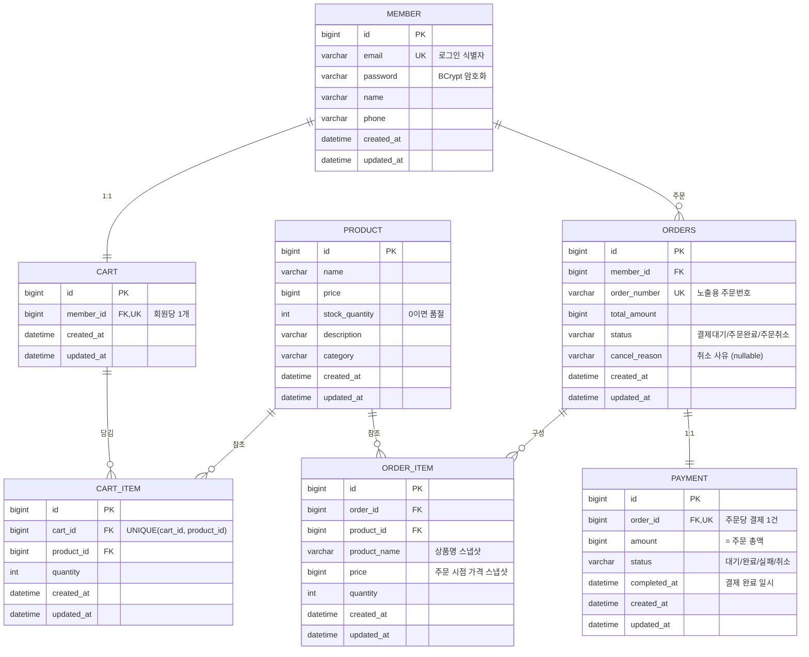
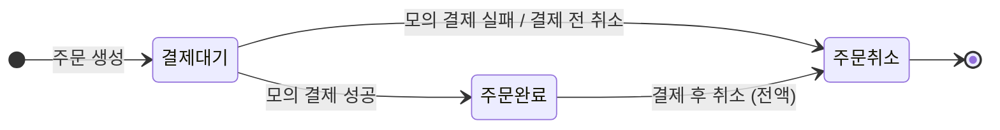

# 🛒 commerce-basic

Spring Boot 기반 커머스 백엔드 프로젝트입니다.
상품 조회부터 장바구니, 주문, 모의 결제, 취소까지 커머스의 핵심 흐름을 처음부터 끝까지 구현합니다.

> 외부 PG 연동 없이 서버 내부에서 결제 승인·거절을 처리하는 **모의 결제** 방식으로,
> 결제의 뼈대인 **선검증 → 상태 전이 → 후처리** 흐름에 집중합니다.

---

## 🧑‍🤝‍🧑 팀원 및 담당 파트

| 이름 | 담당 도메인 | 주요 구현 |
| --- | --- | --- |
| 임경식 | 인증 | 회원가입 · 로그인 · JWT 발급/검증 |
| 이민호 | 상품 | 상품 목록/단건 조회 · 필터 · 페이지네이션 · 공통 모듈 |
| 이건희 | 장바구니 | 담기 · 조회 · 수량 변경 · 삭제 · 비우기 |
| 박지민 | 주문 | 주문 생성(재고 검증·차감) · 목록/상세 조회 |
| 최정이 | 결제 · 취소 | 모의 결제 승인 · 결제 조회 · 주문 취소(전액) |

---

## 🛠 기술 스택

| 분류 | 기술 |
| --- | --- |
| Language | Java 17 |
| Framework | Spring Boot 3.x |
| ORM | Spring Data JPA |
| Database | MySQL |
| Auth | Spring Security + JWT |
| Build | Gradle |
| 협업 | GitHub (PR + 리뷰 1인 승인) · Notion · Slack |

---

## 🗂 ERD (7개 테이블)



### 설계 포인트

- **스냅샷**: 주문 상품에 상품명·가격을 복사 저장. 주문 후 상품 정보가 바뀌어도 과거 주문 금액이 유지됩니다.
- **주문·결제 분리**: 주문(무엇을 샀는가)과 결제(돈이 어떻게 처리됐는가)의 생명주기가 달라 테이블을 분리했습니다. 필수 버전의 부분환불·복합결제 확장을 고려한 구조입니다.
- **UNIQUE 제약**: 회원당 장바구니 1개, 장바구니 내 동일 상품 1행(재담기 시 수량 합산), 주문당 결제 1건.
- **재고 선차감**: 재고는 **주문 생성 시점**에 차감합니다. 결제 실패·주문 취소 시 차감분을 전량 복구하며, 이 복구까지가 하나의 트랜잭션으로 처리됩니다.
- **취소 사유 기록**: 주문이 취소되면 사유(회원 취소 사유 또는 "모의 결제 실패" 등 시스템 사유)를 주문에 기록하고, 주문 상세 조회 시 반환하여 고객이 취소 이유를 확인할 수 있습니다.

---

## 🔄 주문 · 결제 상태 흐름



| 결제 상태 | 의미 |
| --- | --- |
| 대기 | 주문 생성 시 결제 사전 기록 직후 |
| 완료 | 모의 결제 승인 |
| 실패 | 모의 결제 거절 / 결제 전 주문 취소 |
| 취소 | 결제 완료 후 주문 취소 |

허용 전이: `대기 → 완료/실패`, `완료 → 취소`

`주문취소`로 전이될 때는 항상 취소 사유가 함께 기록됩니다.

| 취소 경로 | 기록되는 사유 |
| --- | --- |
| 회원의 주문 취소 | 요청 시 입력한 사유 (예: "단순 변심") |
| 모의 결제 실패 | "결제 실패" (시스템 자동 기록) |

---

## 📋 API 명세

| 도메인 | 기능 | Method | URL | 담당 |
| --- | --- | --- | --- | --- |
| 인증 | 회원가입 | POST | `/api/auth/signup` | 임경식 |
| 인증 | 로그인 | POST | `/api/auth/login` | 임경식 |
| 인증 | 내 정보 조회 | GET | `/api/auth/me` 🔒 | 임경식 |
| 상품 | 상품 목록 조회 | GET | `/api/products` | 이민호 |
| 상품 | 상품 단건 조회 | GET | `/api/products/{productId}` | 이민호 |
| 장바구니 | 상품 담기 | POST | `/api/cart/items` 🔒 | 이건희 |
| 장바구니 | 장바구니 조회 | GET | `/api/cart` 🔒 | 이건희 |
| 장바구니 | 수량 변경 | PATCH | `/api/cart/items/{cartItemId}` 🔒 | 이건희 |
| 장바구니 | 개별 삭제 | DELETE | `/api/cart/items/{cartItemId}` 🔒 | 이건희 |
| 장바구니 | 전체 비우기 | DELETE | `/api/cart` 🔒 | 이건희 |
| 주문 | 주문 생성 | POST | `/api/orders` 🔒 | 박지민 |
| 주문 | 주문 목록 조회 | GET | `/api/orders` 🔒 | 박지민 |
| 주문 | 주문 상세 조회 | GET | `/api/orders/{orderId}` 🔒 | 박지민 |
| 주문 | 주문 미리보기 | POST | `/api/orders/preview` 🔒 | 박지민 |
| 결제 | 모의 결제 승인 | POST | `/api/payments` 🔒 | 최정이 |
| 결제 | 결제 단건 조회 | GET | `/api/payments/{paymentId}` 🔒 | 최정이 |
| 결제 | 주문 취소 (전액) | POST | `/api/payments/{paymentId}/cancel` 🔒 | 최정이 |

🔒 = 인증 필요 (`Authorization: Bearer {token}`)

상품 목록 조회 쿼리 파라미터: `category` · `minPrice` · `maxPrice` · `page` · `size` (모두 선택, 미지정 시 전체 최신순)

주문 취소 요청 본문: `{ "reason": "취소 사유" }` — 기록된 사유는 주문 상세 조회 응답에 포함됩니다.

---

## 🚀 실행 방법

### 1. 사전 준비

- Java 17
- MySQL 8.x

### 2. 데이터베이스 생성

```sql
CREATE DATABASE commerce;
```

### 3. 프로젝트 클론

```bash
git clone https://github.com/commerce-basic-1team/commerce-basic.git
cd commerce-basic
```

### 4. 환경 변수 설정

IntelliJ: `Run → Edit Configurations → Environment variables`

```
DB_PASSWORD=본인 MySQL 비밀번호
```

### 5. 실행

```bash
./gradlew bootRun
```

서버는 `http://localhost:8080` 에서 실행됩니다.
상품 더미 데이터는 애플리케이션 시작 시 자동 등록됩니다.

---

## 🌿 브랜치 전략

```
main ← dev ← feature/{도메인}-{기능}
```

- `main` · `dev` 직접 push 금지 — 모든 변경은 PR로만 (리뷰어 1인 승인 필수)
- 기능 하나 = 브랜치 하나 = PR 하나, 머지 후 브랜치 삭제
- 브랜치 예시: `feature/auth-signup`, `feature/payment-mock-approve`

### 커밋 컨벤션

```
feat: 모의 결제 승인 API 구현
fix: 중복 취소 시 재고 이중 복구 버그 수정
refactor / docs / test / chore
```

---

## 📐 코드 컨벤션 (요약)

- 패키지: 도메인형 (`domain/order`, `global/exception`)
- 엔티티: `@Setter` 금지, 정적 팩토리 생성, 상태 전이는 엔티티 메서드(`approve()`, `cancel()`)
- DTO: record, `~Request` / `~Response` 접미사, `from()` 변환
- 응답: 공통 `ApiResponse` 포맷, 예외는 `ErrorCode` + `GlobalExceptionHandler` 일원화
- 상세 규칙은 팀 노션 참고
